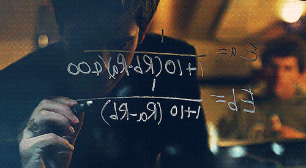

# facesmash
Variant of Facebook Facesmash Code

This was inspired by the scene from the movie Social Network in which Eduardo Saverin, then friend of Facebook founder Mark Zuckerberg, writes an Elo rating algorithm on the window of a Havard dorm.  

 
The algorithm in the film is actually incorrect - it should be:  
Ea = 1/(1+10((Rb-Ra)/400))   
Eb = 1/(1+10((Ra-Rb)/400))  
